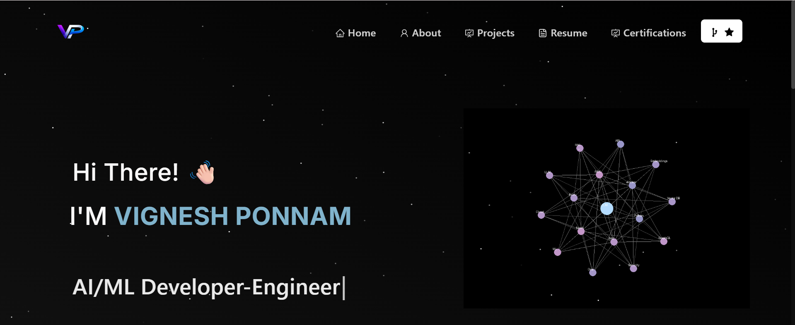

🚀 Vignesh Ponnam – Portfolio Website
<h2 align="center"> Portfolio Website  <a href="https://vigneshponnam-port.vercel.app/" target="_blank">https://vigneshponnam-port.vercel.app/</a> </h2> 
  
   

<h2>📌 About</h2>

This is my personal portfolio website showcasing:

Professional experience

Technical projects

Knowledge Graph & RAG-based systems

Software engineering capabilities

Certifications and technical skills

The website reflects my focus on scalable system design, backend engineering, cloud infrastructure, and intelligent data-driven applications.

<h2>🛠 Built With </h2>

This project was developed using:

React.js

React-Bootstrap

Node.js

JavaScript (ES6+)

CSS3

VS Code

Vercel (Deployment)

<h2>✨ Features </h2>

📖 Multi-page layout (Home, About, Projects, Resume)

🎨 Elegant black & white glass theme

📱 Fully responsive design

🧠 Animated knowledge graph visuals

🔗 Interactive project modal system

🧩 Structured experience & education sections

⚡ Optimized performance and clean UI components

<h2>🧠 Highlighted Work</h2>

Some featured implementations in this portfolio include:

Knowledge Graph–enhanced RAG architectures

Secure document processing pipelines

Full-stack system design projects

Cloud-native data workflows

AI-assisted healthcare and information systems

### Show your support

Give a ⭐ if you like this website!

